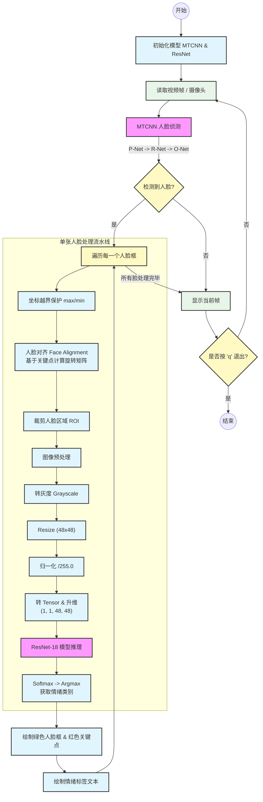

# ***基于MTCNN~(人脸检测)~、ResNet~(卷积神经网络)~与OpenCV~(图像处理)~构建的人脸情绪识别模型***
---
## 获取模型源代码可以访问我的GitHub仓库：[Aimyon69-Design](https://github.com/Aimyon69/pytorch/tree/master/Design)
---
## MTCNN人脸检测模块：
要实现人脸的情绪识别，首先的任务就是将视频流或者图片流中的人脸信息给提取出来，忽略其他例如背景，杂物等无关信息。在此项目中，我们选取了==MTCNN==，实现了对人脸的检测，框选和脸部特征点的提取。实现的具体细节如下所示：
### 1.数据集的选取：
在本项目中训练数据集我们使用了香港中文大学提供的一个开源大规模人脸属性数据集CelebA作为我们MTCNN网络的训练数据集。以下是数据集的官方网站：[CelebA](https://mmlab.ie.cuhk.edu.hk/projects/CelebA.html)。因为其具有人脸检测边框数据标注和特征点坐标的标注数据，作为我们MTCNN网络的训练数据集是合理且适配的。对于ResNet情绪识别模型的数据集我们采用了开源数据集：FER-2013。官方地址为：[FER-2013](https://www.kaggle.com/datasets/msambare/fer2013),它包含了七种情绪的人脸图像，适合本项目的需求。
### 2.MTCNN的基本结构和原理：
MTCNN具有三个网络：==PNet==，==RNet==，==ONet==。
#### PNet：
PNet是一个全卷积网络，它的主要作用是粗略给出图像中人脸的预选框位置，以及特征点坐标。由于它的感受野（卷积核大小）只有12x12，所以对于图像中的大人脸是无法进行识别的。为解决此难题，引入了==图像金字塔==的方法，图像金字塔就是对输入原图像进行多次尺寸缩小，得到许多的子图像，直到子图像的宽或者高小于12个像素就停止缩小。目的就是让原图像中的无法被PNet识别的大人脸缩小到可以被PNet识别，并初步筛选出来。但是上述的图像金字塔会带来另一个问题：同一张脸被多次识别框选。原因是通过图像金字塔得到的子图中会重复出现同一张人脸，经过PNet识别，会重复的识别并框选同一张人脸。为了解决这个问题，我们引入==NMS（非极大值抑制）==，我们将高度重合的框经行一个取极大值的效果，只保留一个是人脸概率最高的框。在这个过程中当然会有不是人脸的部分被PNet识别并框选，接下来我们就需要将PNet的识别结果送给RNet进行进一步筛选。这里在阐释一下为什么PNet网络的识别精度低：==1==网络结构简单，是一个全卷积网络，没有全连接层来精确拟合数据特征。==2==PNet的卷积核的感受野较小（12x12），不能很好的提取人脸的所有特征。==3==为了解决感受野小的问题，图像金字塔的引入，导致人脸像素尺寸被强制的缩小，在此过程中人脸的许多特征细节会被丢失。
##### PNet的pytorch框架搭建：
```python
class PNet(nn.Module):
    def __init__(self):
        super(PNet,self).__init__()
        self.f1=nn.Sequential(nn.Conv2d(in_channels=3,out_channels=10,kernel_size=3,stride=1),
                              nn.PReLU(),
                              nn.MaxPool2d(kernel_size=2,stride=2,ceil_mode=True),
                              nn.Conv2d(in_channels=10,out_channels=16,kernel_size=3,stride=1),
                              nn.PReLU(),
                              nn.Conv2d(in_channels=16,out_channels=32,kernel_size=3,stride=1),
                              nn.PReLU())
        self.classifier=nn.Conv2d(in_channels=32,out_channels=2,kernel_size=1,stride=1)
        self.bbox_reg=nn.Conv2d(in_channels=32,out_channels=4,kernel_size=1,stride=1)
        self.landmark_reg = nn.Conv2d(in_channels=32, out_channels=10, kernel_size=1, stride=1)
    def forward(self,x):
        x=self.f1(x)
        cls_outputs=self.classifier(x)
        bbox_outputs=self.bbox_reg(x)
        landmark_reg_outputs=self.landmark_reg(x)
        return cls_outputs,bbox_outputs,landmark_reg_outputs
```
##### PNet的训练数据集准备：
简单介绍下如何从CelebA得来PNet的训练数据集的。
首先需要阐释的是为什么不能拿celebA的数据集直接来训练我们的MTCNN网络。核心原因是数据标注和类型不符合MTCNN的训练目的。我们MTCNN是一个多任务训练网络，包含==人脸分类==，==人脸框回归==，==人脸特征点回归==三个任务。对于分类任务，我们需要正样本和负样本同时喂给网络训练。对于人脸框和特征点回归任务，我们需要让网络对一个输入随机的图像，推测出人脸真实框的位置，给出的是真实框相对于现在输入的图像框的偏移量。但是CelebA只有正样本，这显然不符合我们分类任务的数据属性需要，对于回归任务来说，不满足输入随机的特性，我们需要在CelebA数据上随机裁剪图像，来生成适合训练的数据集，包含（正样本，负样本，部分样本）。
接着简单解释下如何得到各样本的：我们对图像进行随机裁剪（具体的裁剪逻辑见pnet数据处理py文件），得到许多的待分类图像，按照以下的规则进行分类：
正样本：iou值大于0.65的当作正样本，0.4-0.65的当作部分样本，0.3以下的当作负样本，具体代码如下：
```python
if iou >= 0.65:
            im_tensor = torch.from_numpy(resized_im).permute(2, 0, 1).float() 
            im_tensor = (im_tensor - 127.5) / 127.5  
            pos_cls_list.append({
                "image": im_tensor,
                "label": torch.tensor(1, dtype=torch.long),
                "roi": torch.tensor([-1, -1, -1, -1], dtype=torch.float32) 
            })
            pos_roi_list.append({
                "image": im_tensor,
                "label": torch.tensor(1, dtype=torch.long),
                "roi": torch.tensor([offset_x1, offset_y1, offset_x2, offset_y2], dtype=torch.float32)
            })
            px_list = pts_raw[::2]  
            py_list = pts_raw[1::2] 
            if (min(px_list) > nx1 and min(py_list) > ny1 and
                max(px_list) < nx2 and max(py_list) < ny2):
                pts_x = [(px - nx1) / size for px in px_list]
                pts_y = [(py - ny1) / size for py in py_list]
                pts = []
                for i in range(5):
                    pts.append(pts_x[i])
                    pts.append(pts_y[i]) 
                pts_list.append({
                    "image": im_tensor,
                    "label": torch.tensor(1, dtype=torch.long),
                    "roi": torch.tensor([offset_x1, offset_y1, offset_x2, offset_y2], dtype=torch.float32),
                    "pts": torch.tensor(pts, dtype=torch.float32)
                })
                pts_idx += 1
            p_idx += 1
        elif iou >= 0.4:
            im_tensor = torch.from_numpy(resized_im).permute(2, 0, 1).float()
            im_tensor = (im_tensor - 127.5) / 127.5

            part_roi_list.append({
                "image": im_tensor,
                "label": torch.tensor(-1, dtype=torch.long), 
                "roi": torch.tensor([offset_x1, offset_y1, offset_x2, offset_y2], dtype=torch.float32)
            })
            d_idx += 1
    neg_num = 0
    while neg_num < 10: 
        if min(width, height) // 2 > 40:
            size = random.randint(40, min(width, height) // 2)
        else:
            size = random.randint(min(width, height) // 2, 40)
        size = min(size, width, height)
        nx = random.randint(0, width - size)
        ny = random.randint(0, height - size)
        crop_box = np.array([nx, ny, nx + size, ny + size], dtype=np.float32)
        iou = IoU(crop_box, box.reshape(1, -1))[0]
        if iou < 0.3:
            cropped_im = img[ny:ny+size, nx:nx+size, :]
            resized_im = cv2.resize(cropped_im, (image_size, image_size), interpolation=cv2.INTER_LINEAR)
            im_tensor = torch.from_numpy(resized_im).permute(2, 0, 1).float()
            im_tensor = (im_tensor - 127.5) / 127.5

            neg_cls_list.append({
                "image": im_tensor,
                "label": torch.tensor(0, dtype=torch.long),  
                "roi": torch.tensor([-1, -1, -1, -1], dtype=torch.float32)
            })
            n_idx += 1
            neg_num += 1
```
##### 损失函数的定义：
在模型训练之前，我们介绍下MTCNN损失函数的定义，由于是多任务网络，所以我们需要对损失函数进行一个细化:
```python
class MTCNNLoss(nn.Module):
    def __init__(self):
        super().__init__()
        self.loss_cls=nn.CrossEntropyLoss(reduction='none')
        self.loss_box=nn.MSELoss(reduction='none')
        self.loss_landmark=nn.MSELoss(reduction='none')
    def forward(self,pred_cls,pred_box,pred_landmark,gt_label,gt_box,gt_landmark):
        if pred_cls.dim() == 4:
            pred_cls=pred_cls.squeeze(3).squeeze(2)
            pred_box=pred_box.squeeze(3).squeeze(2)
            pred_landmark=pred_landmark.squeeze(3).squeeze(2)
        mask_cls=torch.ge(gt_label,0)
        valid_cls_label=gt_label[mask_cls]
        valid_cls_pred=pred_cls[mask_cls]
        '''这里我解释下上面的代码意思,因为我们训练人脸分类,只需要正样本和负样本的数据来计算loss值,
        故我们需要剔除-1对应部分样本。第一行代码就是生成掩码,筛选出部分样本。第二,三行代码就是将部分
        样本对应的模型预测值和真实标签剔除掉'''
        if valid_cls_label.shape[0]>0:
            loss_c=self.loss_cls(valid_cls_pred,valid_cls_label)
            loss_c=torch.mean(loss_c)
        else:
            loss_c=torch.tensor(0.0).to(gt_label.device)
            '''解释下,我们要凭空增加一个0张量,如果不传入原来gt_label所在的设备(GPU或者CPU)
            后面进行张量运算时，如果两个张量不在同一个设备上就会出错'''
        
        mask_box=torch.ne(gt_label,0)
        valid_box_gt=gt_box[mask_box]
        valid_box_pred=pred_box[mask_box]
        if valid_box_gt.shape[0]>0:
            loss_b=self.loss_box(valid_box_pred,valid_box_gt)
            loss_b=torch.mean(loss_b)
        else:
            loss_b=torch.tensor(0.0).to(gt_box.device)

        mask_lm=torch.sum(torch.abs(gt_landmark),dim=1)>0
        valid_lm_gt=gt_landmark[mask_lm]
        valid_lm_pred=pred_landmark[mask_lm]
        if valid_lm_gt.shape[0]>0:
            loss_l=self.loss_landmark(valid_lm_pred,valid_lm_gt)#(k,10)
            loss_l=torch.mean(loss_l)
        else:
            loss_l=torch.tensor(0.0).to(gt_landmark.device)
        total_loss=loss_c*1.0+loss_b*0.5+loss_l*0.5
        return total_loss,loss_c,loss_b,loss_l
```
总结来说，就是正，负样本的label值用来计算我们的分类loss值，正，部分样本的roi值来计算我们的人脸框回归loss值，pts值不为全0的样本用来计算我们的特征点loss值。最后按照`total_loss=loss_c*1.0+loss_b*0.5+loss_l*0.5`得到加权loss值以来反向传播计算梯度，更新参数。这里需注意以下问题：total_loss来反向传播的,但是是如何确保我的三个子损失值是按梯度下降的方向变化的。
##### PNet模型的训练：
整体框架如下：
```python
def train():
    device=torch.device('cuda')
    batch_size=384
    lr=0.001
    epochs=30
    train_loader=get_dataloader(batch_size)
    model=PNet()
    model=model.to(device)
    criterion=MTCNNLoss()
    optimizer=torch.optim.Adam(model.parameters(),lr=lr)
    scheduler = torch.optim.lr_scheduler.MultiStepLR(optimizer, milestones=[10, 20], gamma=0.1)
    for epoch in range(epochs):
        model.train()
        epoch_loss=0
        since=time.time()
        for step,(img,label,roi,pts) in enumerate(train_loader):
            img=img.to(device)
            label=label.to(device)
            roi=roi.to(device)
            pts=pts.to(device)
            cls_out,box_out,landmark_out=model(img)
            loss,l_cls,l_box,l_pts=criterion(cls_out,box_out,landmark_out,label,roi,pts)
            optimizer.zero_grad()
            loss.backward()
            optimizer.step()
            epoch_loss+=loss.item()
        print(f'epoch:{epoch}')
        print(f'loss:{epoch_loss/len(train_loader):.4f}')
        print(f'consuming time:{time.time()-since}')
        print('.'*20)
        scheduler.step()
    torch.save(model.state_dict(),'D:/Code/pytorch/Design/pnet.pth')
if __name__=='__main__':
    train()
```
训练结果如下：

#### RNet
RNet的训练数据来自于PNet的识别图像结果跟原始数据集的对比，将PNet的识别结果分为正样本，部分样本，负样本供RNet训练。目的就是让RNet剔除PNet关于人脸分类的错误，和进一步精进人脸框的偏移量输出。将上一级网络不易识别的困难样本送给下一级网络进行学习和修正的过程叫做：==困难数据挖掘==。
##### RNet的pytorch框架搭建：
RNet相对于PNet多了一层全连接层，对于数据特征的拟合更加强，精度提高。
```python 
class RNet(nn.Module):
    def __init__(self):
        super(RNet,self).__init__()
        self.flatten=nn.Flatten()
        self.backbone=nn.Sequential(nn.Conv2d(in_channels=3,out_channels=28,kernel_size=3),
                                    nn.PReLU(),
                                    nn.MaxPool2d(kernel_size=3,stride=2,ceil_mode=True),
                                    nn.Conv2d(in_channels=28,out_channels=48,kernel_size=3),
                                    nn.PReLU(),
                                    nn.MaxPool2d(kernel_size=3,stride=2,ceil_mode=True),
                                    nn.Conv2d(in_channels=48,out_channels=64,kernel_size=2),
                                    nn.PReLU())
        self.fc=nn.Sequential(nn.Linear(64*3*3,128),
                              nn.PReLU())
        self.cls_layer=nn.Linear(128,2)
        self.bbox_layer=nn.Linear(128,4)
        self.landmark_layer=nn.Linear(128,10)
    def forward(self,x):
        x=self.backbone(x)
        x=self.flatten(x)
        x=self.fc(x)
        cls_out=self.cls_layer(x)
        bbox_out=self.bbox_layer(x)
        lm_out=self.landmark_layer(x)
        return cls_out,bbox_out,lm_out
```
##### RNet的训练数据集准备：
部分代码如下：
```python
if valid_pts:
                pts_offsets = []
                for k in range(5):
                    pts_offsets.append((landmark_gt[2*k] - nx1) / wid)
                    pts_offsets.append((landmark_gt[2*k+1] - ny1) / hei)
                pts_str = " ".join([f"{p:.3f}" for p in pts_offsets])
            else:
                pts_str = "0 0 0 0 0 0 0 0 0 0"
            zeros_str = "0 0 0 0 0 0 0 0 0 0"
            if iou_val>=0.65:
                save_img=save_dir+f'/img_rnet/pos_image/{idx}.jpg'
                write_pts = pts_str if valid_pts else zeros_str
                
                f_pos.write(f'{save_img} 1 {off_x1} {off_y1} {off_x2} {off_y2} {write_pts}\n')
                cv2.imwrite(save_img,resized_img)
                idx+=1
            elif 0.4<=iou_val<=0.65:
                save_img=save_dir+f'/img_rnet/part_image/{idx}.jpg'
                f_part.write(f'{save_img} -1 {off_x1} {off_y1} {off_x2} {off_y2} {zeros_str}\n')
                cv2.imwrite(save_img,resized_img)
                idx+=1
            elif iou_val<0.3:
                save_img=save_dir+f'/img_rnet/neg_image/{idx}.jpg'
                f_neg.write(f'{save_img} 0 0 0 0 0 {zeros_str}\n')
                cv2.imwrite(save_img,resized_img)
                idx+=1
```
整体的逻辑就是将PNet的判断结果跟真实人脸框数据进行求iou的操作。根据iou的值，分别保存为正，负，部分样本。供RNet学习,让其学习PNet的错误判读，并纠正。

由于PNet的“宁放过一千，不杀死一个”的特性，产生负样本的数量远远大于正样本的数量。我处理了两百万个样本，只有两万个正样本。
##### RNet模型的训练：
其代码与PNet的训练代码几乎一样不多赘述
```python
import os
import sys
sys.path.append('D:/Code/pytorch/Design/mtcnn/data_process')
import time
import torch
import torch.nn as nn
from dataset import MTCNNDataset
import torch.utils.data as Data
from model_rely import RNet,get_rnet_dataloader,MTCNNLoss
import matplotlib.pyplot as plt
def train():
    device=torch.device('cuda')
    batch_size=384
    lr=0.001
    epochs=30
    train_loader=get_rnet_dataloader(batch_size)
    model=RNet()
    model=model.to(device)
    criterion=MTCNNLoss()
    optimizer=torch.optim.Adam(model.parameters(),lr=lr)
    scheduler = torch.optim.lr_scheduler.MultiStepLR(optimizer, milestones=[10, 20], gamma=0.1)
    for epoch in range(epochs):
        model.train()
        epoch_loss=0
        since=time.time()
        for step,(img,label,roi,pts) in enumerate(train_loader):
            img=img.to(device)
            label=label.to(device)
            roi=roi.to(device)
            pts=pts.to(device)
            cls_out,box_out,landmark_out=model(img)
            loss,l_cls,l_box,l_pts=criterion(cls_out,box_out,landmark_out,label,roi,pts)
            optimizer.zero_grad()
            loss.backward()
            optimizer.step()
            epoch_loss+=loss.item()
        print(f'epoch:{epoch}')
        print(f'loss:{epoch_loss/len(train_loader):.4f}')
        print(f'consuming time:{time.time()-since}')
        print('.'*20)
        scheduler.step()
    torch.save(model.state_dict(),'D:/Code/pytorch/Design/rnet.pth')
if __name__=='__main__':
    train()
```
训练结果如下：

#### ONet
这是最终的Boss，ONet具有三个网络中最复杂的模型结构：卷积层为四个，全连接层的神经元更多，模型参数大幅增长。也正是这些特性使得它具有更强的拟合筛选特性。而且由于困难数据挖掘的设计哲学，使得这像是个用奥数作为训练作业的超级天才，将非人脸的错误框彻底剔除，对人脸框的框选更加精准。
##### ONet的pytorch框架搭建：
```python
class ONet(nn.Module):
    def __init__(self):
        super(ONet,self).__init__()
        self.backbone=nn.Sequential(nn.Conv2d(in_channels=3,out_channels=32,kernel_size=3,stride=1),
                                    nn.PReLU(),
                                    nn.MaxPool2d(kernel_size=3,stride=2,ceil_mode=True),
                                    nn.Conv2d(in_channels=32,out_channels=64,kernel_size=3,stride=1),
                                    nn.PReLU(),
                                    nn.MaxPool2d(kernel_size=3,stride=2,ceil_mode=True),
                                    nn.Conv2d(in_channels=64,out_channels=64,kernel_size=3,stride=1),
                                    nn.PReLU(),
                                    nn.MaxPool2d(kernel_size=2,stride=2,ceil_mode=True),
                                    nn.Conv2d(in_channels=64,out_channels=128,kernel_size=2,stride=1),
                                    nn.PReLU())
        self.flatten=nn.Flatten()
        self.fc=nn.Sequential(nn.Linear(128*3*3,256),
                              nn.PReLU())
        self.cls_layer=nn.Linear(256,2)
        self.bbox_layer=nn.Linear(256,4)
        self.landmark_layer=nn.Linear(256,10)
    def forward(self,x):
        x=self.backbone(x)
        x=self.flatten(x)
        x=self.fc(x)
        cls_out=self.cls_layer(x)
        box_out=self.bbox_layer(x)
        landmark_out=self.landmark_layer(x)
        return cls_out,box_out,landmark_out
```
##### ONet的训练数据集准备：
逻辑与RNet数据集处理一样，不多叙述。
```python
if iou_val>=0.65:
                if valid_pts:
                    path='D:/Code/pytorch/Design/mtcnn/data_process/data/img_onet/pos_image'
                    f_pos.write(f'{path}/{idx}.jpg 1 {off_x1} {off_y1} {off_x2} {off_y2} {pts_str}\n')
                    cv2.imwrite(path+f'/{idx}.jpg',resized_img)
                else:
                    path='D:/Code/pytorch/Design/mtcnn/data_process/data/img_onet/pos_image'
                    f_pos.write(f'{path}/{idx}.jpg 1 {off_x1} {off_y1} {off_x2} {off_y2} 0 0 0 0 0 0 0 0 0 0\n')
                    cv2.imwrite(path+f'/{idx}.jpg',resized_img)
                idx+=1
            elif 0.4<=iou_val<0.65:
                path='D:/Code/pytorch/Design/mtcnn/data_process/data/img_onet/part_image'
                f_part.write(f'{path}/{idx}.jpg -1 {off_x1} {off_y1} {off_x2} {off_y2} 0 0 0 0 0 0 0 0 0 0\n')
                cv2.imwrite(path+f'/{idx}.jpg',resized_img)
                idx+=1
            elif iou_val<0.3:
                path='D:/Code/pytorch/Design/mtcnn/data_process/data/img_onet/neg_image'
                f_neg.write(f'{path}/{idx}.jpg 0 0 0 0 0 0 0 0 0 0 0 0 0 0 0\n')
                cv2.imwrite(path+f'/{idx}.jpg',resized_img)
                idx+=1
```
##### ONet的模型训练：
```python
import os
import sys
sys.path.append('D:/Code/pytorch/Design/mtcnn/data_process')
import time
import torch
import torch.nn as nn
from dataset import MTCNNDataset
import torch.utils.data as Data
from model_rely import ONet,get_onet_dataloader,MTCNNLoss
import matplotlib.pyplot as plt
def train():
    device=torch.device('cuda')
    batch_size=384
    lr=0.001
    epochs=30
    train_loader=get_onet_dataloader(batch_size)
    model=ONet()
    model=model.to(device)
    criterion=MTCNNLoss()
    optimizer=torch.optim.Adam(model.parameters(),lr=lr)
    scheduler = torch.optim.lr_scheduler.MultiStepLR(optimizer, milestones=[10, 20], gamma=0.1)
    for epoch in range(epochs):
        model.train()
        epoch_loss=0
        since=time.time()
        for step,(img,label,roi,pts) in enumerate(train_loader):
            img=img.to(device)
            label=label.to(device)
            roi=roi.to(device)
            pts=pts.to(device)
            cls_out,box_out,landmark_out=model(img)
            loss,l_cls,l_box,l_pts=criterion(cls_out,box_out,landmark_out,label,roi,pts)
            optimizer.zero_grad()
            loss.backward()
            optimizer.step()
            epoch_loss+=loss.item()
        print(f'epoch:{epoch}')
        print(f'loss:{epoch_loss/len(train_loader):.4f}')
        print(f'consuming time:{time.time()-since}')
        print('.'*20)
        scheduler.step()
    torch.save(model.state_dict(),'D:/Code/pytorch/Design/onet.pth')
if __name__=='__main__':
    train()
```
训练结果：

## ResNet情绪识别
### ResNet18的结构和原理：
#### ResNet18的pytorch框架：
```python
import torch
import torch.nn as nn
import numpy as np
class BasicBlock(nn.Module):
    expansion=1
    def __init__(self,in_channels,out_channels,stride=1):
        super(BasicBlock,self).__init__()
        self.conv1=nn.Conv2d(in_channels=in_channels,out_channels=out_channels,kernel_size=3,stride=stride,padding=1,bias=False)
        self.bn1=nn.BatchNorm2d(out_channels)
        self.conv2=nn.Conv2d(in_channels=out_channels,out_channels=out_channels,kernel_size=3,stride=1,padding=1,bias=False)
        self.bn2=nn.BatchNorm2d(out_channels)
        self.shortcut=nn.Sequential()
        if stride!=1 or in_channels!=self.expansion*out_channels:
            self.shortcut=nn.Sequential(nn.Conv2d(in_channels,self.expansion*out_channels,kernel_size=1,stride=stride,bias=False),
                                        nn.BatchNorm2d(self.expansion*out_channels))
        self.relu=nn.ReLU()
    def forward(self,x):
        out=self.relu(self.bn1(self.conv1(x)))
        out=self.bn2(self.conv2(out))
        out+=self.shortcut(x)
        out=self.relu(out)
        return out
class ResNet(nn.Module):
    def __init__(self,block,num_blocks,num_classes=7,in_channels=1):
        super(ResNet,self).__init__()
        self.in_channels=64
        self.conv1=nn.Conv2d(in_channels,64,kernel_size=3,stride=1,padding=1,bias=False)
        self.bn1=nn.BatchNorm2d(64)
        self.layer1=self.make_layer(block,64,num_blocks[0],stride=1)
        self.layer2=self.make_layer(block,128,num_blocks[1],stride=2)
        self.layer3=self.make_layer(block,256,num_blocks[2],stride=2)
        self.layer4=self.make_layer(block,512,num_blocks[3],stride=2)
        self.avg_pool=nn.AdaptiveAvgPool2d((1,1))
        self.fc=nn.Linear(512*block.expansion,num_classes)
        self.relu=nn.ReLU()
        self.flatten=nn.Flatten()
    def make_layer(self,block,out_channels,num_blocks,stride):
        strides=[stride]+[1]*(num_blocks-1)
        layers=[]
        for s in strides:
            layers.append(block(self.in_channels,out_channels,s))
            self.in_channels=out_channels*block.expansion
        return nn.Sequential(*layers)
    def forward(self,x):
        out=self.relu(self.bn1(self.conv1(x)))
        out=self.layer1(out)
        out=self.layer2(out)
        out=self.layer3(out)
        out=self.layer4(out)
        out=self.avg_pool(out)
        out=self.flatten(out)
        out=self.fc(out)
        return out
def ResNet18(num_classes=7,in_channels=1):
    return ResNet(BasicBlock,[2,2,2,2],num_classes,in_channels)
```
#### ResNet18的模型训练
```python
import torch
import torch.nn as nn
import torch.optim as optim
import time
import os
import sys
from model import ResNet18
from emo_dataset import get_emotion_dataloader
def train():
    data_dir='D:/Code/pytorch/Design/ResNet/Fer2013'
    num_epochs=60
    batch_size=128
    lr=0.01
    device=torch.device('cuda')
    dataloaders,datasize,class_names=get_emotion_dataloader(data_dir,batch_size)
    model=ResNet18(num_classes=7,in_channels=1)
    model=model.to(device)
    criterion=nn.CrossEntropyLoss()
    opti=optim.SGD(model.parameters(),lr=lr,momentum=0.9,weight_decay=5e-4)
    scheduler=optim.lr_scheduler.StepLR(opti,step_size=20,gamma=0.1)
    best_acc=0.0
    since=time.time()
    for epoch in range(num_epochs):
        print(f'epoch:{epoch}')
        print('-'*20)
        for phase in ['train','val']:
            if phase=='train':
                model.train()
            else:
                model.eval()
            epoch_loss=0.0
            epoch_corrects=0
            for inputs,labels in dataloaders[phase]:
                inputs=inputs.to(device)
                labels=labels.to(device)
                opti.zero_grad()
                with torch.set_grad_enabled(phase=='train'):
                    outputs=model(inputs)
                    _,preds=torch.max(outputs,1)
                    loss=criterion(outputs,labels)
                    if phase=='train':
                        loss.backward()
                        opti.step()
                epoch_loss+=loss.item()*inputs.size(0)
                epoch_corrects+=torch.sum(preds==labels.data)
            if phase=='train':
                scheduler.step()
            epoch_loss=epoch_loss/datasize[phase]
            epoch_acc=epoch_corrects.double()/datasize[phase]
            print(f'{phase} loss:{epoch_loss:.4f} acc:{epoch_acc:.4f}')
            if phase=='val' and epoch_acc>best_acc:
                best_acc=epoch_acc
                torch.save(model.state_dict(),'D:/Code/pytorch/Design/resnet.pth')
            print(f'consuming time:{time.time()-since}')
if __name__=='__main__':
    train()
```
#### ResNet的模型训练数据集处理：
这一部分我们省略，因为没有什么特殊处理，直接喂数据就行。
#### ResNet原理：
ResNet（残差网络）的核心原理是通过引入“捷径连接（Shortcut Connection）”直接将输入加到卷积层的输出上（即 $Output = F(x) + x$），让网络专注于学习输入与目标之间的差异（残差）而非完整的映射，从而有效解决了深层网络中的梯度消失问题，使模型能够轻松训练并精准捕捉人脸的深层情绪特征。
#### 为什么选择ResNet18：
它在该数据集上能达到71%-73%的准确率，与ResNet50、VGG19等模型相当，但参数量和计算量更小，推理速度更快，适配MTCNN串联后的实时应用需求；其残差连接解决了梯度消失问题，收敛快、易训练，且结构简单，可轻松改造适配48x48灰度图输入，相比深层网络或复杂架构，更契合数据集中等规模、噪声大的特性及自主搭建与调优的需求。
## 整体架构：

## 效果展示


