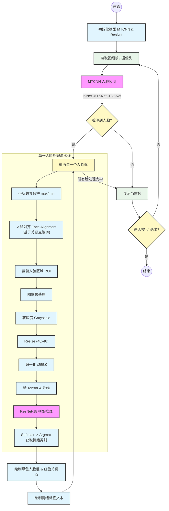

# 基于 MTCNN (人脸检测)、ResNet (卷积神经网络) 与 OpenCV(图像处理)的人脸情绪识别系统

> **项目源码**：欢迎访问我的 GitHub 仓库 [Aimyon69-Design](https://github.com/Aimyon69/pytorch/tree/master/Design) 获取完整代码。

---

## 一、MTCNN 人脸检测模块

实现人脸情绪识别的第一步，是从复杂的视频流或图像背景中精准提取人脸信息。本项目选用 **MTCNN (Multi-task Cascaded Convolutional Networks)** 算法，实现了高效的人脸检测、边界框回归及关键点定位。

### 1. 数据集选取
* **人脸检测 (MTCNN)**：采用香港中文大学的 **[CelebA 数据集](https://mmlab.ie.cuhk.edu.hk/projects/CelebA.html)**。该数据集拥有丰富的人脸边框和特征点标注，非常适合训练 MTCNN 的 P/R/O 网络。
* **情绪识别 (ResNet)**：采用 Kaggle 开源的 **[FER-2013 数据集](https://www.kaggle.com/datasets/msambare/fer2013)**。它包含七种主要情绪的分类数据，完全满足本项目需求。

### 2. MTCNN 的基本结构与原理
MTCNN 由三个级联的卷积神经网络组成：**PNet**、**RNet** 和 **ONet**。

#### 2.1 PNet (Proposal Network)
PNet 是一个全卷积网络，主要负责快速生成候选框。
* **图像金字塔**：由于 PNet 的感受野仅为 12x12，无法直接识别大尺寸人脸。我们引入图像金字塔，将原图按比例多次缩放，使不同尺寸的人脸都能落入 PNet 的检测范围。
* **NMS (非极大值抑制)**：针对同一人脸可能产生多个重叠框的问题，利用 NMS 算法去除冗余框，保留置信度最高的一个。

**PNet 精度较低的原因分析：**
1.  **网络结构简单**：全卷积结构，层数少，特征提取能力有限。
2.  **感受野受限**：12x12 的窗口难以捕获全局人脸特征。
3.  **信息丢失**：图像金字塔的缩放过程会导致部分细节特征模糊。

##### PNet 网络结构 (PyTorch实现)
```python
class PNet(nn.Module):
    def __init__(self):
        super(PNet, self).__init__()
        # 特征提取层
        self.f1 = nn.Sequential(
            nn.Conv2d(3, 10, kernel_size=3, stride=1),
            nn.PReLU(),
            nn.MaxPool2d(kernel_size=2, stride=2, ceil_mode=True),
            nn.Conv2d(10, 16, kernel_size=3, stride=1),
            nn.PReLU(),
            nn.Conv2d(16, 32, kernel_size=3, stride=1),
            nn.PReLU()
        )
        # 多任务输出层
        self.classifier = nn.Conv2d(32, 2, kernel_size=1, stride=1)    # 人脸分类
        self.bbox_reg = nn.Conv2d(32, 4, kernel_size=1, stride=1)      # 边框回归
        self.landmark_reg = nn.Conv2d(32, 10, kernel_size=1, stride=1) # 关键点回归

    def forward(self, x):
        x = self.f1(x)
        return self.classifier(x), self.bbox_reg(x), self.landmark_reg(x)
```

##### 训练数据预处理

MTCNN 是多任务学习，CelebA 的原始标注均为正样本，无法直接训练分类任务。我们需要对原始图像进行随机裁剪，生成三类样本：

  * **正样本 (Positive)**：IoU ≥ 0.65，用于分类、边框回归、关键点回归。
  * **部分样本 (Part)**：0.4 ≤ IoU < 0.65，仅用于边框回归。
  * **负样本 (Negative)**：IoU < 0.3，仅用于分类。

##### 损失函数定义

针对多任务学习，我们自定义了损失函数，对分类、回归和关键点损失进行加权求和。**注意：** 利用掩码 (Mask) 机制，确保不同类型的样本只计算其对应的损失（例如负样本不计算回归损失）。
```python
class MTCNNLoss(nn.Module):
    def __init__(self):
        super().__init__()
        self.loss_cls = nn.CrossEntropyLoss(reduction='none')
        self.loss_box = nn.MSELoss(reduction='none')
        self.loss_landmark = nn.MSELoss(reduction='none')

    def forward(self, pred_cls, pred_box, pred_landmark, gt_label, gt_box, gt_landmark):
        # ... (维度调整代码省略) ...
        
        # 1. 分类损失 (仅针对正、负样本)
        mask_cls = torch.ge(gt_label, 0)
        valid_cls_label = gt_label[mask_cls]
        valid_cls_pred = pred_cls[mask_cls]
        loss_c = torch.mean(self.loss_cls(valid_cls_pred, valid_cls_label)) if valid_cls_label.shape[0] > 0 else torch.tensor(0.0).to(gt_label.device)

        # 2. 边框回归损失 (仅针对正、部分样本)
        mask_box = torch.ne(gt_label, 0)
        valid_box_gt = gt_box[mask_box]
        valid_box_pred = pred_box[mask_box]
        loss_b = torch.mean(self.loss_box(valid_box_pred, valid_box_gt)) if valid_box_gt.shape[0] > 0 else torch.tensor(0.0).to(gt_box.device)

        # 3. 关键点损失 (仅针对含关键点的样本)
        mask_lm = torch.sum(torch.abs(gt_landmark), dim=1) > 0
        loss_l = torch.mean(self.loss_landmark(pred_landmark[mask_lm], gt_landmark[mask_lm])) if mask_lm.sum() > 0 else torch.tensor(0.0).to(gt_landmark.device)

        # 加权求和
        return loss_c * 1.0 + loss_b * 0.5 + loss_l * 0.5, loss_c, loss_b, loss_l
```
#### 2.2 RNet (Refine Network)

RNet 的训练数据源于 **困难样本挖掘 (Hard Example Mining)**：即利用训练好的 PNet 对数据进行检测，收集 PNet 识别错误的样本（False Positives）作为 RNet 的负样本。这使得 RNet 能够专门学习区分那些容易被混淆的“假人脸”。

**网络特点**：相比 PNet 增加了一层全连接层，特征拟合能力更强，能有效滤除 PNet 的误检框，并微调边框位置。

#### 2.3 ONet (Output Network)

ONet 是级联结构的最后一层，也是结构最复杂的一层。它拥有更多的卷积层和神经元，不仅负责最终的人脸判定，还负责输出高精度的 5 个关键点坐标。经过 PNet 和 RNet 的层层筛选，ONet 面临的是最高难度的判别任务，因此其精度至关重要。

-----

## 二、ResNet 情绪识别模块

### 1\. 为什么选择 ResNet18？

针对 FER-2013 数据集（48x48 灰度图），我们选择了 **ResNet18**，原因如下：

1.  **性能优越**：在该数据集上可达到 71%-73% 的准确率，媲美 VGG19 等深层网络。
2.  **轻量高效**：参数量适中，推理速度快，完美适配实时视频流处理。
3.  **抗退化**：残差连接（Shortcut Connection）有效解决了梯度消失问题，模型收敛更快。
4.  **易于适配**：结构简单，易于修改第一层卷积以适配 48x48 的小尺寸输入。

### 2\. ResNet18 网络结构
为了适配 48x48 输入，我们去掉了原版 ResNet 第一层的 7x7 卷积和池化，改用 3x3 卷积，保留更多空间特征。
```python
class BasicBlock(nn.Module):
    expansion = 1
    def __init__(self, in_channels, out_channels, stride=1):
        super(BasicBlock, self).__init__()
        # ... (基础残差块定义) ...
        # 核心：Shortcut 连接
        if stride != 1 or in_channels != self.expansion * out_channels:
            self.shortcut = nn.Sequential(
                nn.Conv2d(in_channels, self.expansion * out_channels, kernel_size=1, stride=stride, bias=False),
                nn.BatchNorm2d(self.expansion * out_channels)
            )

    def forward(self, x):
        out = F.relu(self.bn1(self.conv1(x)))
        out = self.bn2(self.conv2(out))
        out += self.shortcut(x)  # 残差相加 F(x) + x
        out = F.relu(out)
        return out

class ResNet(nn.Module):
    def __init__(self, block, num_blocks, num_classes=7, in_channels=1):
        super(ResNet, self).__init__()
        self.in_channels = 64
        # 修改点：适应小尺寸输入的 conv1
        self.conv1 = nn.Conv2d(in_channels, 64, kernel_size=3, stride=1, padding=1, bias=False)
        self.bn1 = nn.BatchNorm2d(64)
        # ... (Layer 1-4 定义) ...
        self.fc = nn.Linear(512 * block.expansion, num_classes)

def ResNet18(num_classes=7, in_channels=1):
    return ResNet(BasicBlock, [2, 2, 2, 2], num_classes, in_channels)
```

-----

## 三、系统整体架构

本系统采用串联架构，实现端到端的实时情绪识别。



-----

## 四、相关截图展示


